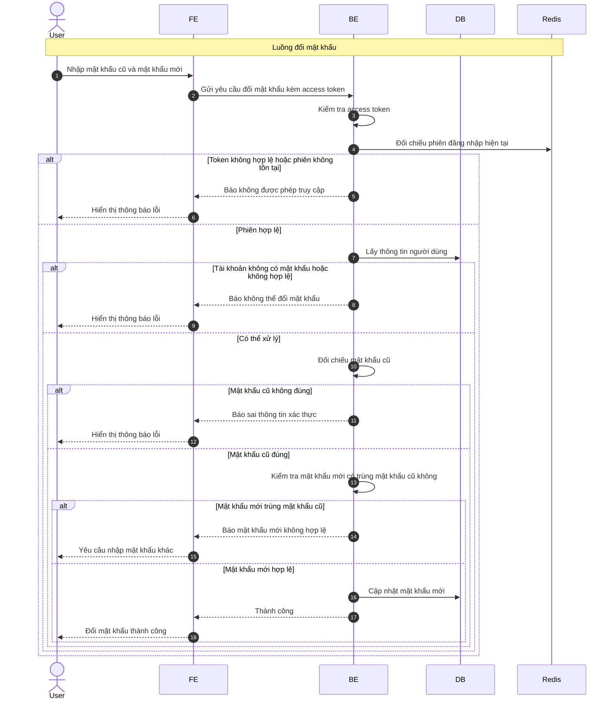

# Sequence Diagram: Đổi mật khẩu

Sơ đồ dưới đây mô tả ngắn gọn nghiệp vụ đổi mật khẩu khi người dùng đang đăng nhập. Hệ thống yêu cầu xác thực phiên hiện tại và kiểm tra mật khẩu cũ trước khi cập nhật.

