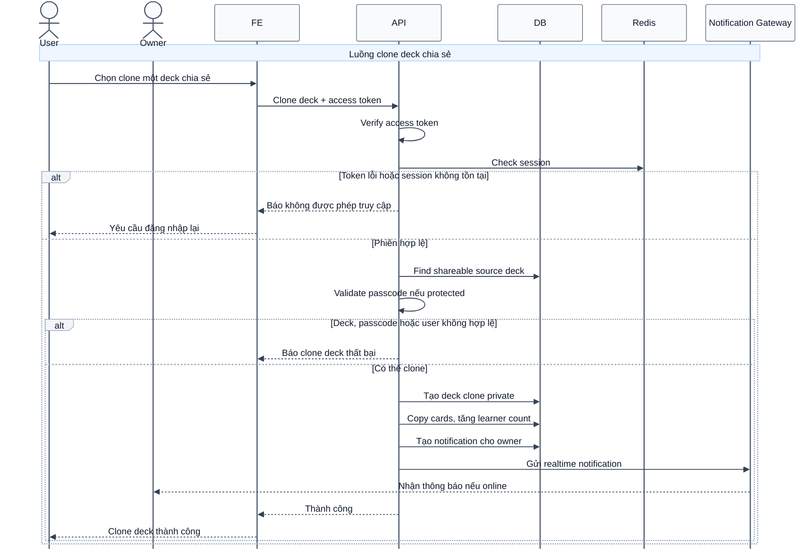

# Sequence Diagram: Clone deck chia sẻ

Sơ đồ dưới đây mô tả ngắn gọn nghiệp vụ clone một deck chia sẻ trong module `deck`. Khi clone thành công, hệ thống tăng learner count, tạo thông báo cho chủ deck gốc và gửi realtime notification nếu chủ deck đang online.

