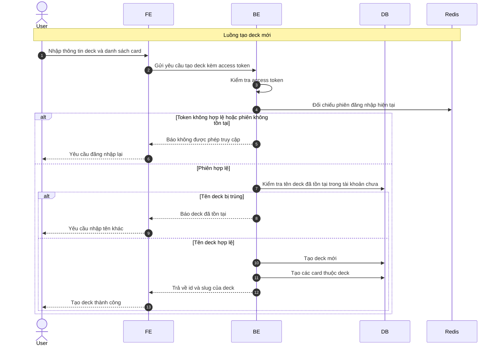

# Sequence Diagram: Tạo deck mới

Sơ đồ dưới đây mô tả ngắn gọn nghiệp vụ tạo deck mới trong module `deck`. Khi hợp lệ, hệ thống tạo deck, sinh slug tự động và lưu danh sách card ban đầu.

```mermaid
sequenceDiagram
	autonumber
	actor User
	participant FE as FE
	participant BE as BE
	participant DB as DB
	participant Redis as Redis

	Note over User,Redis: Luồng tạo deck mới
	User->>FE: Nhập thông tin deck và danh sách card
	FE->>BE: Gửi yêu cầu tạo deck kèm access token
	BE->>BE: Kiểm tra access token
	BE->>Redis: Đối chiếu phiên đăng nhập hiện tại
	alt Token không hợp lệ hoặc phiên không tồn tại
		BE-->>FE: Báo không được phép truy cập
		FE-->>User: Yêu cầu đăng nhập lại
	else Phiên hợp lệ
		BE->>DB: Kiểm tra tên deck đã tồn tại trong tài khoản chưa
		alt Tên deck bị trùng
			BE-->>FE: Báo deck đã tồn tại
			FE-->>User: Yêu cầu nhập tên khác
		else Tên deck hợp lệ
			BE->>DB: Tạo deck mới
			BE->>DB: Tạo các card thuộc deck
			BE-->>FE: Trả về id và slug của deck
			FE-->>User: Tạo deck thành công
		end
	end
```
