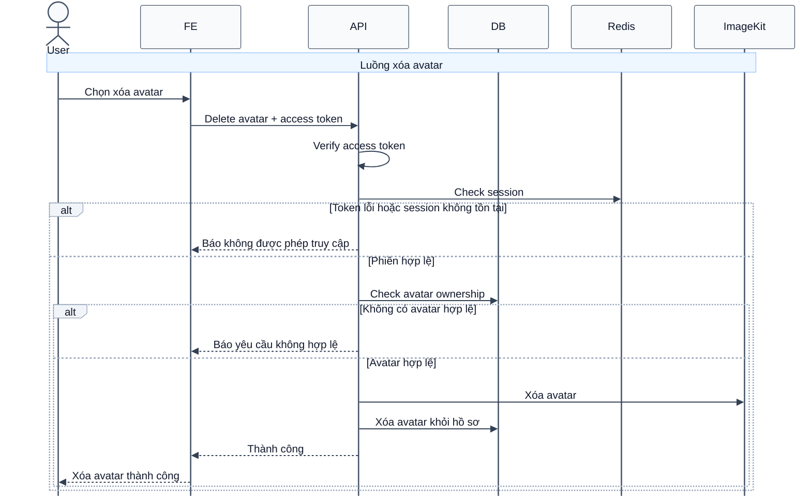

# Sequence Diagram: Xóa avatar

Sơ đồ dưới đây mô tả ngắn gọn nghiệp vụ xóa avatar trong module `user`. Hệ thống chỉ cho phép xóa avatar đang gắn với chính người dùng hiện tại.

```mermaid
---
config:
  theme: base
  look: classic
  sequence:
    showSequenceNumbers: false
    mirrorActors: false
    diagramMarginX: 12
    diagramMarginY: 8
    actorMargin: 34
    boxMargin: 6
    boxTextMargin: 4
    noteMargin: 6
    messageMargin: 24
  themeVariables:
    background: "#ffffff"
    mainBkg: "#ffffff"
    actorBkg: "#f8fafc"
    actorBorder: "#475569"
    actorTextColor: "#0f172a"
    signalColor: "#334155"
    signalTextColor: "#0f172a"
    noteBkgColor: "#eef6ff"
    noteTextColor: "#0f172a"
    noteBorderColor: "#93c5fd"
    loopTextColor: "#0f172a"
    activationBkgColor: "#e0f2fe"
    activationBorderColor: "#0284c7"
    labelBoxBkgColor: "#f1f5f9"
    labelBoxBorderColor: "#94a3b8"
    labelTextColor: "#0f172a"
    fontFamily: "Arial"
    fontSize: "12px"
---
sequenceDiagram
	actor User
	participant FE as FE
	participant BE as API
	participant DB as DB
	participant Redis as Redis
	participant ImageKit as ImageKit

	Note over User,ImageKit: Luồng xóa avatar
	User->>FE: Chọn xóa avatar
	FE->>BE: Delete avatar + access token
	BE->>BE: Verify access token
	BE->>Redis: Check session
	alt Token lỗi hoặc session không tồn tại
		BE-->>FE: Báo không được phép truy cập
	else Phiên hợp lệ
		BE->>DB: Check avatar ownership
		alt Không có avatar hợp lệ
			BE-->>FE: Báo yêu cầu không hợp lệ
		else Avatar hợp lệ
			BE->>ImageKit: Xóa avatar
			BE->>DB: Xóa avatar khỏi hồ sơ
			BE-->>FE: Thành công
			FE-->>User: Xóa avatar thành công
		end
	end
```
