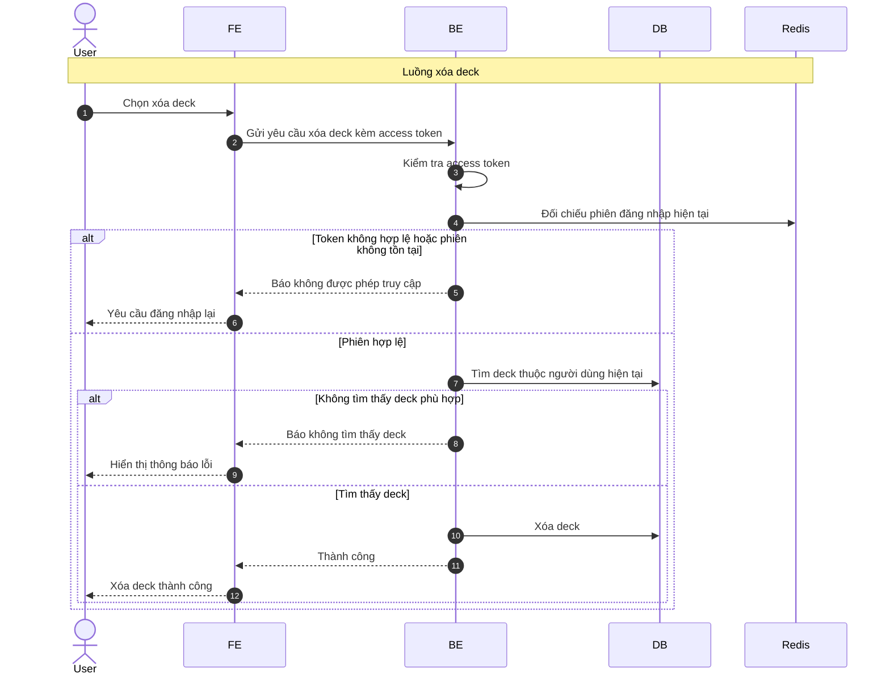

# Sequence Diagram: Xóa deck

Sơ đồ dưới đây mô tả ngắn gọn nghiệp vụ xóa deck trong module `deck`. Hệ thống chỉ cho phép xóa deck thuộc về chính người dùng hiện tại.

```mermaid
sequenceDiagram
	autonumber
	actor User
	participant FE as FE
	participant BE as BE
	participant DB as DB
	participant Redis as Redis

	Note over User,Redis: Luồng xóa deck
	User->>FE: Chọn xóa deck
	FE->>BE: Gửi yêu cầu xóa deck kèm access token
	BE->>BE: Kiểm tra access token
	BE->>Redis: Đối chiếu phiên đăng nhập hiện tại
	alt Token không hợp lệ hoặc phiên không tồn tại
		BE-->>FE: Báo không được phép truy cập
		FE-->>User: Yêu cầu đăng nhập lại
	else Phiên hợp lệ
		BE->>DB: Tìm deck thuộc người dùng hiện tại
		alt Không tìm thấy deck phù hợp
			BE-->>FE: Báo không tìm thấy deck
			FE-->>User: Hiển thị thông báo lỗi
		else Tìm thấy deck
			BE->>DB: Xóa deck
			BE-->>FE: Thành công
			FE-->>User: Xóa deck thành công
		end
	end
```
