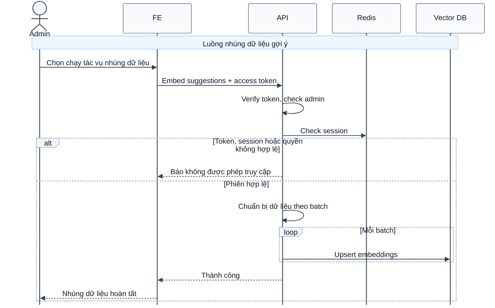

# Sequence Diagram: Nhúng dữ liệu gợi ý

Sơ đồ dưới đây mô tả ngắn gọn nghiệp vụ nhúng dữ liệu gợi ý vào vector database. Luồng này chỉ dành cho admin để chuẩn bị dữ liệu phục vụ chức năng gợi ý.

```mermaid
---
config:
  theme: base
  look: classic
  sequence:
    showSequenceNumbers: false
    mirrorActors: false
    diagramMarginX: 12
    diagramMarginY: 8
    actorMargin: 34
    boxMargin: 6
    boxTextMargin: 4
    noteMargin: 6
    messageMargin: 24
  themeVariables:
    background: "#ffffff"
    mainBkg: "#ffffff"
    actorBkg: "#f8fafc"
    actorBorder: "#475569"
    actorTextColor: "#0f172a"
    signalColor: "#334155"
    signalTextColor: "#0f172a"
    noteBkgColor: "#eef6ff"
    noteTextColor: "#0f172a"
    noteBorderColor: "#93c5fd"
    loopTextColor: "#0f172a"
    activationBkgColor: "#e0f2fe"
    activationBorderColor: "#0284c7"
    labelBoxBkgColor: "#f1f5f9"
    labelBoxBorderColor: "#94a3b8"
    labelTextColor: "#0f172a"
    fontFamily: "Arial"
    fontSize: "12px"
---
sequenceDiagram
	actor Admin
	participant FE as FE
	participant BE as API
	participant Redis as Redis
	participant VectorDB as Vector DB

	Note over Admin,VectorDB: Luồng nhúng dữ liệu gợi ý
	Admin->>FE: Chọn chạy tác vụ nhúng dữ liệu
	FE->>BE: Embed suggestions + access token
	BE->>BE: Verify token, check admin
	BE->>Redis: Check session
	alt Token, session hoặc quyền không hợp lệ
		BE-->>FE: Báo không được phép truy cập
	else Phiên hợp lệ
		BE->>BE: Chuẩn bị dữ liệu theo batch
		loop Mỗi batch
			BE->>VectorDB: Upsert embeddings
		end
		BE-->>FE: Thành công
		FE-->>Admin: Nhúng dữ liệu hoàn tất
	end
```
