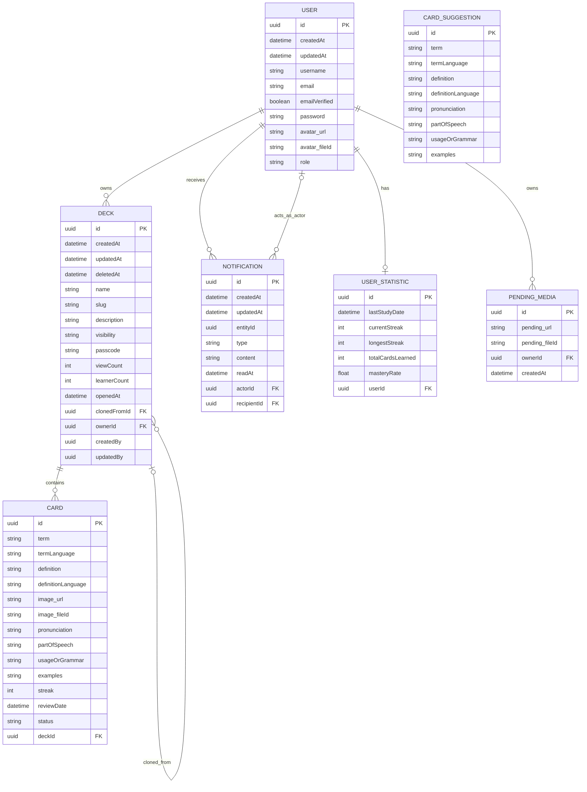

# Entity Relationship Diagram

```mermaid
erDiagram
    USER {
        uuid id PK
        datetime createdAt
        datetime updatedAt
        string username
        string email
        boolean emailVerified
        string password
        string avatar_url
        string avatar_fileId
        string role
    }

    DECK {
        uuid id PK
        datetime createdAt
        datetime updatedAt
        datetime deletedAt
        string name
        string slug
        string description
        string visibility
        string passcode
        int viewCount
        int learnerCount
        datetime openedAt
        uuid clonedFromId FK
        uuid ownerId FK
        uuid createdBy
        uuid updatedBy
    }

    CARD {
        uuid id PK
        string term
        string termLanguage
        string definition
        string definitionLanguage
        string image_url
        string image_fileId
        string pronunciation
        string partOfSpeech
        string usageOrGrammar
        string examples
        int streak
        datetime reviewDate
        string status
        uuid deckId FK
    }

    NOTIFICATION {
        uuid id PK
        datetime createdAt
        datetime updatedAt
        uuid entityId
        string type
        string content
        datetime readAt
        uuid actorId FK
        uuid recipientId FK
    }

    USER_STATISTIC {
        uuid id PK
        datetime lastStudyDate
        int currentStreak
        int longestStreak
        int totalCardsLearned
        float masteryRate
        uuid userId FK
    }

    PENDING_MEDIA {
        uuid id PK
        string pending_url
        string pending_fileId
        uuid ownerId FK
        datetime createdAt
    }

    CARD_SUGGESTION {
        uuid id PK
        string term
        string termLanguage
        string definition
        string definitionLanguage
        string pronunciation
        string partOfSpeech
        string usageOrGrammar
        string examples
    }

    USER ||--o{ DECK : owns
    DECK o|--o{ DECK : cloned_from
    DECK ||--o{ CARD : contains
    USER ||--o{ NOTIFICATION : receives
    USER o|--o{ NOTIFICATION : acts_as_actor
    USER ||--o| USER_STATISTIC : has
    USER ||--o{ PENDING_MEDIA : owns
```

Lưu ý: `NOTIFICATION.entityId` hiện là UUID nghiệp vụ, không được khai báo quan hệ FK trực tiếp trong entity, nên ERD không nối cứng trường này tới bảng khác.
