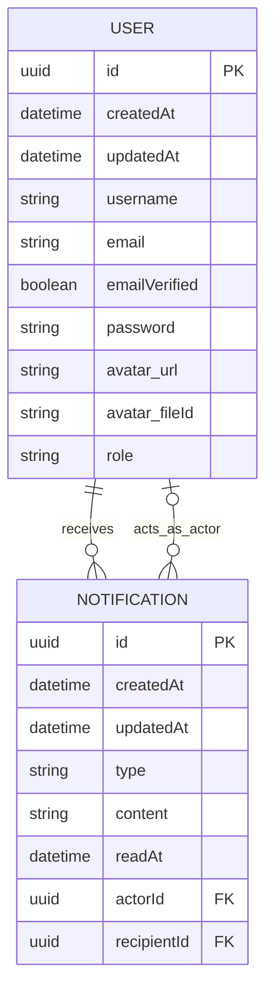

# Entity Relationship Diagram

```mermaid
erDiagram
    USER {
        uuid id PK
        datetime createdAt
        datetime updatedAt
        string username
        string email
        boolean emailVerified
        string password
        string avatar_url
        string avatar_fileId
        string role
    }

    NOTIFICATION {
        uuid id PK
        datetime createdAt
        datetime updatedAt
        string type
        string content
        datetime readAt
        uuid actorId FK
        uuid recipientId FK
    }

    USER ||--o{ NOTIFICATION : receives
    USER o|--o{ NOTIFICATION : acts_as_actor
```
