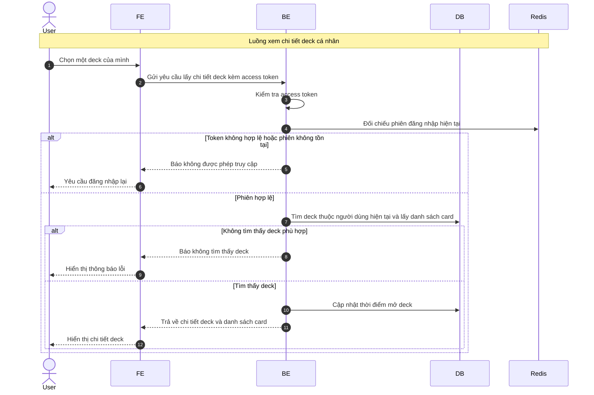

# Sequence Diagram: Xem chi tiết deck cá nhân

Sơ đồ dưới đây mô tả ngắn gọn nghiệp vụ xem chi tiết một deck cá nhân trong module `deck`. Khi mở deck thành công, hệ thống cập nhật thời điểm mở gần nhất của deck đó.

