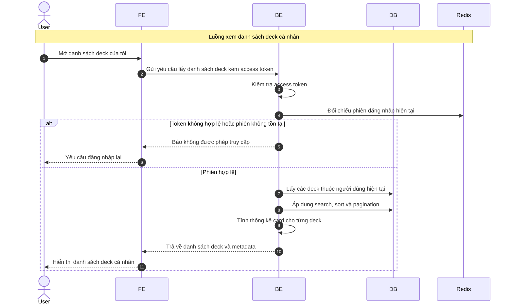

# Sequence Diagram: Xem danh sách deck cá nhân

Sơ đồ dưới đây mô tả ngắn gọn nghiệp vụ xem danh sách deck cá nhân trong module `deck`. Hệ thống chỉ trả dữ liệu khi người dùng có phiên đăng nhập hợp lệ.

