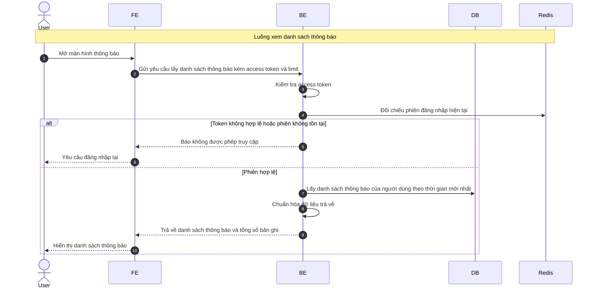

# Sequence Diagram: Xem danh sách thông báo

Sơ đồ dưới đây mô tả ngắn gọn nghiệp vụ xem danh sách thông báo của người dùng. Hệ thống chỉ trả dữ liệu khi phiên đăng nhập còn hợp lệ.

```mermaid
sequenceDiagram
	autonumber
	actor User
	participant FE as FE
	participant BE as BE
	participant DB as DB
	participant Redis as Redis

	Note over User,Redis: Luồng xem danh sách thông báo
	User->>FE: Mở màn hình thông báo
	FE->>BE: Gửi yêu cầu lấy danh sách thông báo kèm access token và limit
	BE->>BE: Kiểm tra access token
	BE->>Redis: Đối chiếu phiên đăng nhập hiện tại
	alt Token không hợp lệ hoặc phiên không tồn tại
		BE-->>FE: Báo không được phép truy cập
		FE-->>User: Yêu cầu đăng nhập lại
	else Phiên hợp lệ
		BE->>DB: Lấy danh sách thông báo của người dùng theo thời gian mới nhất
		BE->>BE: Chuẩn hóa dữ liệu trả về
		BE-->>FE: Trả về danh sách thông báo và tổng số bản ghi
		FE-->>User: Hiển thị danh sách thông báo
	end
```
