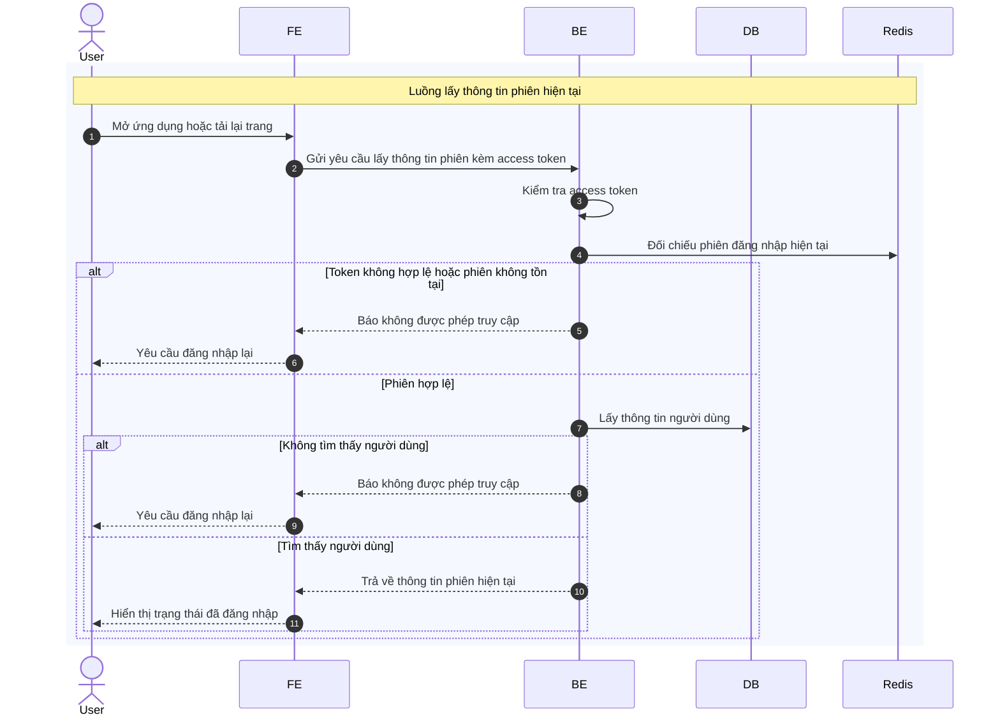

# Sequence Diagram: Lấy thông tin phiên hiện tại

Sơ đồ dưới đây mô tả ngắn gọn nghiệp vụ lấy thông tin phiên đăng nhập hiện tại. Hệ thống chỉ trả dữ liệu khi access token hợp lệ và còn gắn với phiên đang hoạt động.

