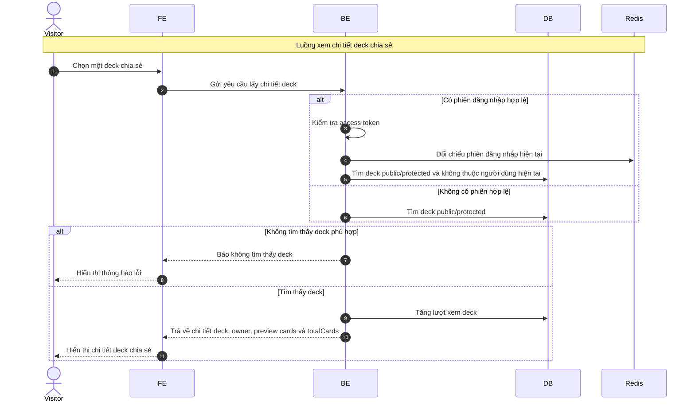

# Sequence Diagram: Xem chi tiết deck chia sẻ

Sơ đồ dưới đây mô tả ngắn gọn nghiệp vụ xem chi tiết một deck chia sẻ trong module `deck`. Luồng này hỗ trợ guest và user; nếu người dùng đã đăng nhập thì hệ thống không trả về deck của chính họ trong màn hình chia sẻ.

