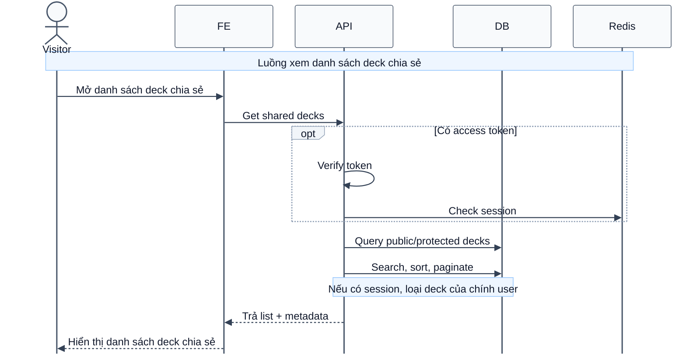

# Sequence Diagram: Xem danh sách deck chia sẻ

Sơ đồ dưới đây mô tả ngắn gọn nghiệp vụ xem danh sách deck chia sẻ trong module `deck`. Luồng này là public, vì vậy guest vẫn có thể truy cập; nếu người dùng đã có phiên hợp lệ thì hệ thống sẽ không trả về deck của chính họ.

