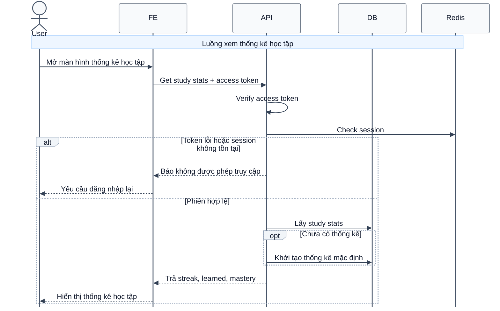

# Sequence Diagram: Xem thống kê học tập

Sơ đồ dưới đây mô tả ngắn gọn nghiệp vụ xem thống kê học tập của người dùng. Nếu người dùng chưa có dữ liệu thống kê, hệ thống sẽ khởi tạo bản ghi mặc định trước khi trả kết quả.

