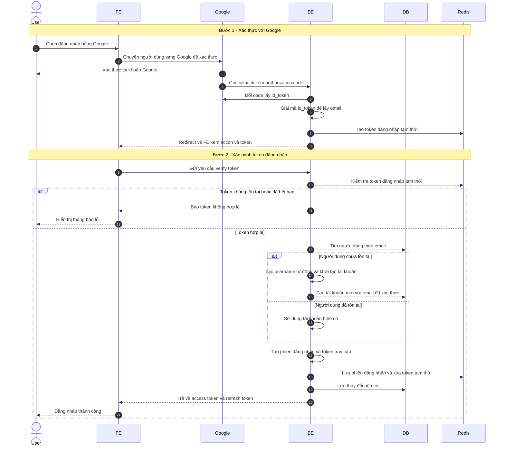

# Sequence Diagram: Đăng nhập bằng Google

Sơ đồ dưới đây mô tả ngắn gọn nghiệp vụ đăng nhập bằng Google. Sau khi Google xác thực thành công, backend tạo một mã đăng nhập tạm thời, chuyển hướng về frontend, rồi hoàn tất đăng nhập thông qua bước xác minh mã này.

