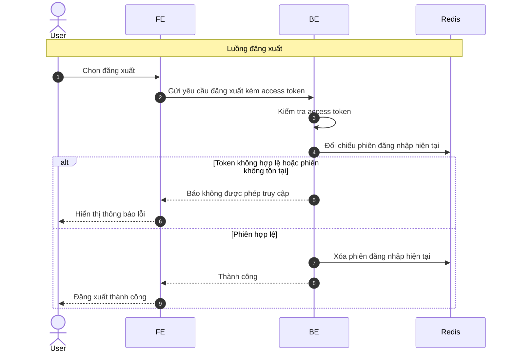

# Sequence Diagram: Đăng xuất

Sơ đồ dưới đây mô tả ngắn gọn nghiệp vụ đăng xuất. Khi người dùng đăng xuất, hệ thống xóa phiên hiện tại trong Redis để token không còn được chấp nhận.

```mermaid
sequenceDiagram
	autonumber
	actor User
	participant FE as FE
	participant BE as BE
	participant Redis as Redis

	Note over User,Redis: Luồng đăng xuất
	User->>FE: Chọn đăng xuất
	FE->>BE: Gửi yêu cầu đăng xuất kèm access token
	BE->>BE: Kiểm tra access token
	BE->>Redis: Đối chiếu phiên đăng nhập hiện tại
	alt Token không hợp lệ hoặc phiên không tồn tại
		BE-->>FE: Báo không được phép truy cập
		FE-->>User: Hiển thị thông báo lỗi
	else Phiên hợp lệ
		BE->>Redis: Xóa phiên đăng nhập hiện tại
		BE-->>FE: Thành công
		FE-->>User: Đăng xuất thành công
	end
```
