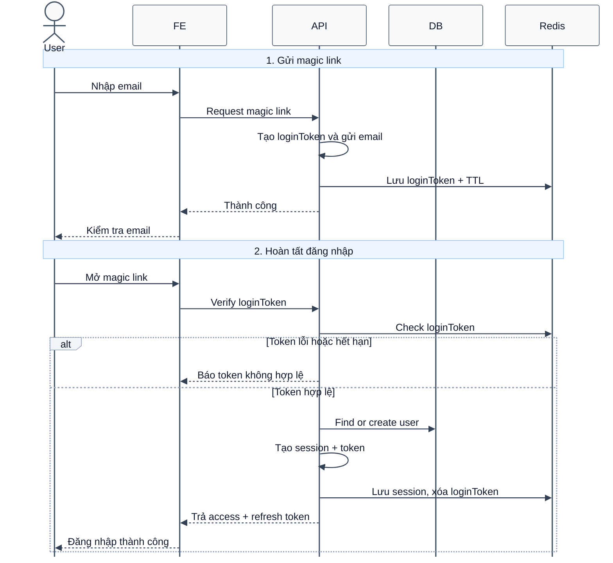

# Sequence Diagram: Đăng nhập bằng Magic Link

Sơ đồ dưới đây mô tả ngắn gọn nghiệp vụ đăng nhập bằng magic link. Người dùng yêu cầu nhận liên kết đăng nhập qua email, sau đó frontend dùng token trong liên kết để hoàn tất đăng nhập.

