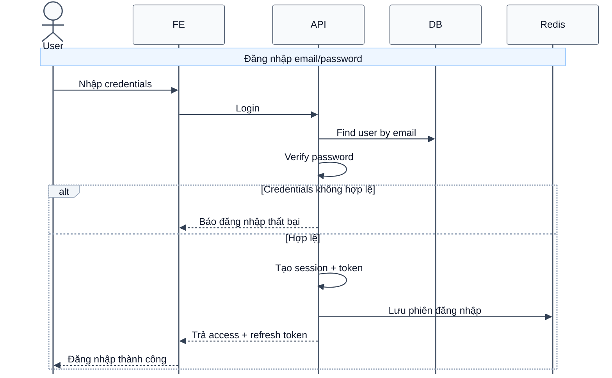

# Sequence Diagram: Đăng nhập bằng email và mật khẩu

Sơ đồ dưới đây mô tả ngắn gọn nghiệp vụ đăng nhập bằng email và mật khẩu. Khi thông tin hợp lệ, hệ thống tạo phiên đăng nhập và trả về bộ token cho frontend.

