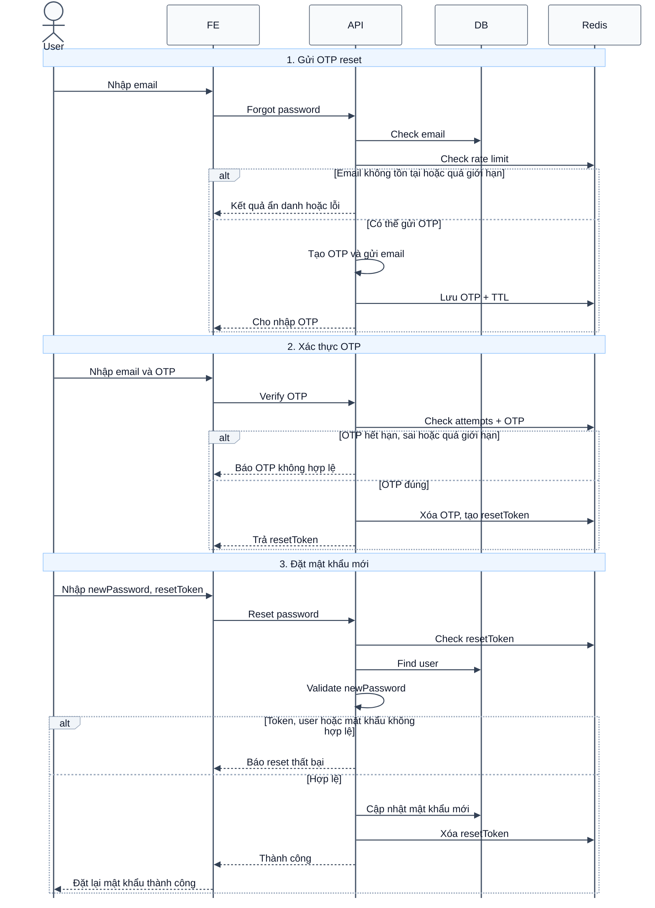

# Sequence Diagram: Quên mật khẩu

Sơ đồ dưới đây mô tả ngắn gọn nghiệp vụ quên mật khẩu. Người dùng yêu cầu OTP, xác thực OTP, sau đó dùng mã xác nhận tạm thời để đặt lại mật khẩu mới.

```mermaid
---
config:
  theme: base
  look: classic
  sequence:
    showSequenceNumbers: false
    mirrorActors: false
    diagramMarginX: 12
    diagramMarginY: 8
    actorMargin: 34
    boxMargin: 6
    boxTextMargin: 4
    noteMargin: 6
    messageMargin: 24
  themeVariables:
    background: "#ffffff"
    mainBkg: "#ffffff"
    actorBkg: "#f8fafc"
    actorBorder: "#475569"
    actorTextColor: "#0f172a"
    signalColor: "#334155"
    signalTextColor: "#0f172a"
    noteBkgColor: "#eef6ff"
    noteTextColor: "#0f172a"
    noteBorderColor: "#93c5fd"
    loopTextColor: "#0f172a"
    activationBkgColor: "#e0f2fe"
    activationBorderColor: "#0284c7"
    labelBoxBkgColor: "#f1f5f9"
    labelBoxBorderColor: "#94a3b8"
    labelTextColor: "#0f172a"
    fontFamily: "Arial"
    fontSize: "12px"
---
sequenceDiagram
	actor User
	participant FE as FE
	participant BE as API
	participant DB as DB
	participant Redis as Redis

	Note over User,Redis: 1. Gửi OTP reset
	User->>FE: Nhập email
	FE->>BE: Forgot password
	BE->>DB: Check email
	BE->>Redis: Check rate limit
	alt Email không tồn tại hoặc quá giới hạn
		BE-->>FE: Kết quả ẩn danh hoặc lỗi
	else Có thể gửi OTP
		BE->>BE: Tạo OTP và gửi email
		BE->>Redis: Lưu OTP + TTL
		BE-->>FE: Cho nhập OTP
	end

	Note over User,Redis: 2. Xác thực OTP
	User->>FE: Nhập email và OTP
	FE->>BE: Verify OTP
	BE->>Redis: Check attempts + OTP
	alt OTP hết hạn, sai hoặc quá giới hạn
		BE-->>FE: Báo OTP không hợp lệ
	else OTP đúng
		BE->>Redis: Xóa OTP, tạo resetToken
		BE-->>FE: Trả resetToken
	end

	Note over User,Redis: 3. Đặt mật khẩu mới
	User->>FE: Nhập newPassword, resetToken
	FE->>BE: Reset password
	BE->>Redis: Check resetToken
	BE->>DB: Find user
	BE->>BE: Validate newPassword
	alt Token, user hoặc mật khẩu không hợp lệ
		BE-->>FE: Báo reset thất bại
	else Hợp lệ
		BE->>DB: Cập nhật mật khẩu mới
		BE->>Redis: Xóa resetToken
		BE-->>FE: Thành công
		FE-->>User: Đặt lại mật khẩu thành công
	end
```
