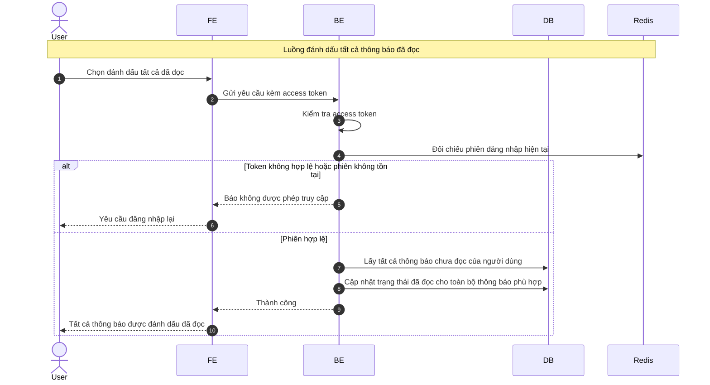

# Sequence Diagram: Đánh dấu tất cả thông báo đã đọc

Sơ đồ dưới đây mô tả ngắn gọn nghiệp vụ đánh dấu tất cả thông báo chưa đọc của người dùng thành đã đọc.

```mermaid
sequenceDiagram
	autonumber
	actor User
	participant FE as FE
	participant BE as BE
	participant DB as DB
	participant Redis as Redis

	Note over User,Redis: Luồng đánh dấu tất cả thông báo đã đọc
	User->>FE: Chọn đánh dấu tất cả đã đọc
	FE->>BE: Gửi yêu cầu kèm access token
	BE->>BE: Kiểm tra access token
	BE->>Redis: Đối chiếu phiên đăng nhập hiện tại
	alt Token không hợp lệ hoặc phiên không tồn tại
		BE-->>FE: Báo không được phép truy cập
		FE-->>User: Yêu cầu đăng nhập lại
	else Phiên hợp lệ
		BE->>DB: Lấy tất cả thông báo chưa đọc của người dùng
		BE->>DB: Cập nhật trạng thái đã đọc cho toàn bộ thông báo phù hợp
		BE-->>FE: Thành công
		FE-->>User: Tất cả thông báo được đánh dấu đã đọc
	end
```
