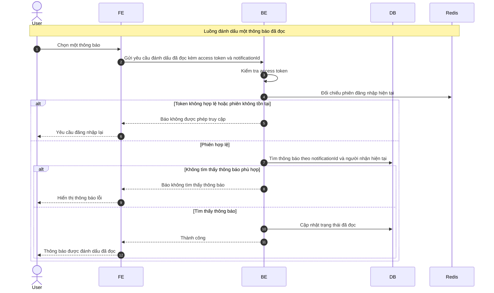

# Sequence Diagram: Đánh dấu một thông báo đã đọc

Sơ đồ dưới đây mô tả ngắn gọn nghiệp vụ đánh dấu một thông báo là đã đọc. Hệ thống chỉ cho phép cập nhật nếu thông báo thuộc về đúng người dùng hiện tại.

