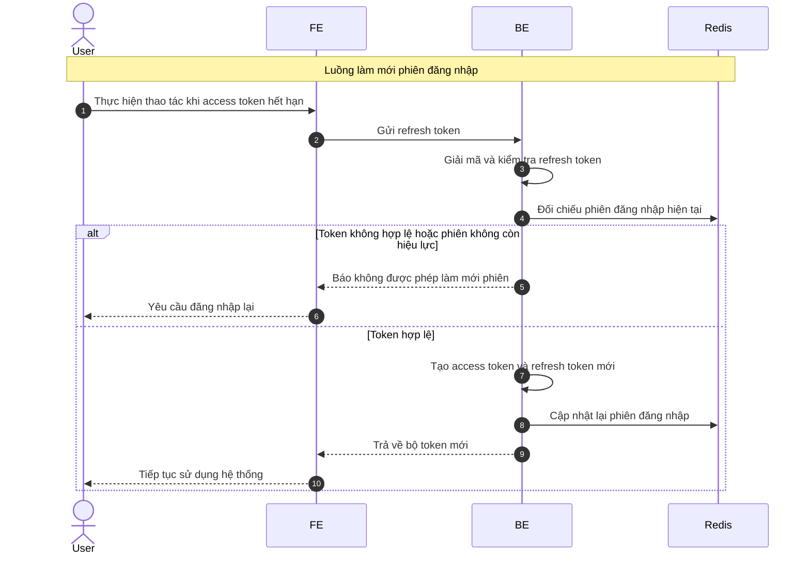

# Sequence Diagram: Làm mới phiên đăng nhập

Sơ đồ dưới đây mô tả ngắn gọn nghiệp vụ làm mới phiên đăng nhập bằng refresh token. Hệ thống chỉ chấp nhận refresh token còn hiệu lực và đang gắn với phiên hợp lệ trong Redis.

