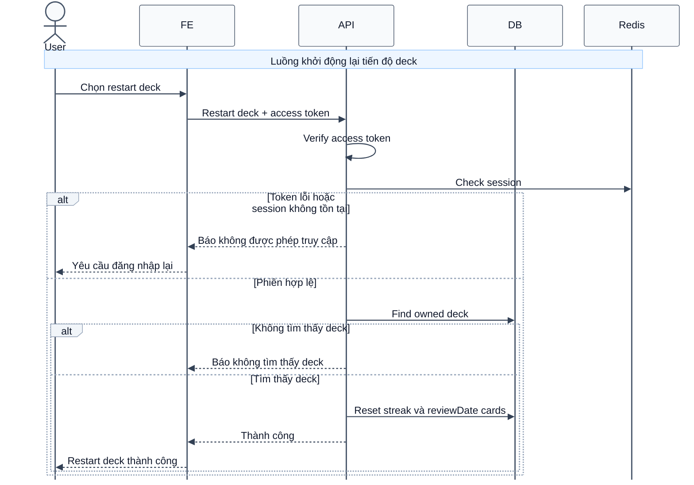

# Sequence Diagram: Khởi động lại tiến độ deck

Sơ đồ dưới đây mô tả ngắn gọn nghiệp vụ khởi động lại tiến độ học của một deck trong module `deck`. Hệ thống đưa toàn bộ card trong deck về trạng thái học lại từ đầu.

