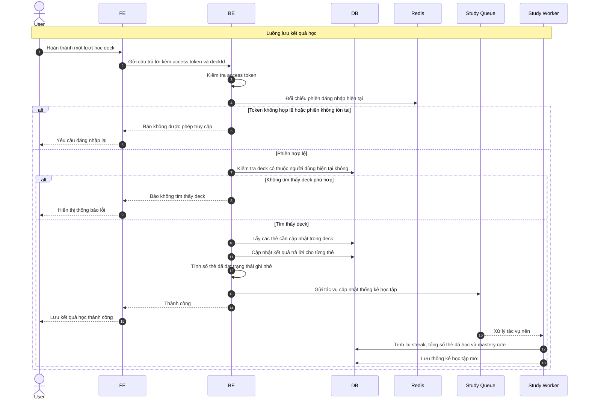

# Sequence Diagram: Lưu kết quả học

Sơ đồ dưới đây mô tả ngắn gọn nghiệp vụ lưu kết quả học của người dùng trên một deck. Sau khi cập nhật kết quả của các thẻ, hệ thống gửi thêm một tác vụ nền để cập nhật thống kê học tập.

