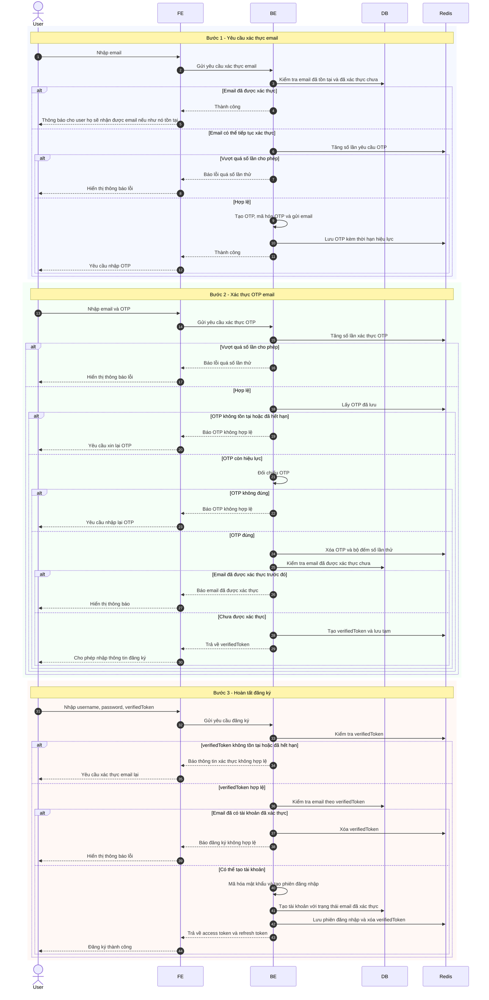

# Sequence Diagram: Đăng ký và xác thực email

Sơ đồ dưới đây mô tả ngắn gọn nghiệp vụ đăng ký tài khoản bằng email/password, trong đó người dùng phải xác thực email trước khi hoàn tất đăng ký.

```mermaid
sequenceDiagram
	autonumber
	actor User
	participant FE as FE
	participant BE as BE
	participant DB as DB
	participant Redis as Redis

	rect rgb(245, 248, 255)
	Note over User,Redis: Bước 1 - Yêu cầu xác thực email
	User->>FE: Nhập email
	FE->>BE: Gửi yêu cầu xác thực email
	BE->>DB: Kiểm tra email đã tồn tại và đã xác thực chưa
	alt Email đã được xác thực
		BE-->>FE: Thành công
		FE-->>User: Thông báo cho user họ sẽ nhận được email nếu như nó tồn tại
	else Email có thể tiếp tục xác thực
		BE->>Redis: Tăng số lần yêu cầu OTP
		alt Vượt quá số lần cho phép
			BE-->>FE: Báo lỗi quá số lần thử
			FE-->>User: Hiển thị thông báo lỗi
		else Hợp lệ
			BE->>BE: Tạo OTP, mã hóa OTP và gửi email
			BE->>Redis: Lưu OTP kèm thời hạn hiệu lực
			BE-->>FE: Thành công
			FE-->>User: Yêu cầu nhập OTP
		end
	end
	end

	rect rgb(245, 255, 247)
	Note over User,Redis: Bước 2 - Xác thực OTP email
	User->>FE: Nhập email và OTP
	FE->>BE: Gửi yêu cầu xác thực OTP
	BE->>Redis: Tăng số lần xác thực OTP
	alt Vượt quá số lần cho phép
		BE-->>FE: Báo lỗi quá số lần thử
		FE-->>User: Hiển thị thông báo lỗi
	else Hợp lệ
		BE->>Redis: Lấy OTP đã lưu
		alt OTP không tồn tại hoặc đã hết hạn
			BE-->>FE: Báo OTP không hợp lệ
			FE-->>User: Yêu cầu xin lại OTP
		else OTP còn hiệu lực
			BE->>BE: Đối chiếu OTP
			alt OTP không đúng
				BE-->>FE: Báo OTP không hợp lệ
				FE-->>User: Yêu cầu nhập lại OTP
			else OTP đúng
				BE->>Redis: Xóa OTP và bộ đếm số lần thử
				BE->>DB: Kiểm tra email đã được xác thực chưa
				alt Email đã được xác thực trước đó
					BE-->>FE: Báo email đã được xác thực
					FE-->>User: Hiển thị thông báo
				else Chưa được xác thực
					BE->>Redis: Tạo verifiedToken và lưu tạm
					BE-->>FE: Trả về verifiedToken
					FE-->>User: Cho phép nhập thông tin đăng ký
				end
			end
		end
	end
	end

	rect rgb(255, 248, 245)
	Note over User,Redis: Bước 3 - Hoàn tất đăng ký
	User->>FE: Nhập username, password, verifiedToken
	FE->>BE: Gửi yêu cầu đăng ký
	BE->>Redis: Kiểm tra verifiedToken
	alt verifiedToken không tồn tại hoặc đã hết hạn
		BE-->>FE: Báo thông tin xác thực không hợp lệ
		FE-->>User: Yêu cầu xác thực email lại
	else verifiedToken hợp lệ
		BE->>DB: Kiểm tra email theo verifiedToken
		alt Email đã có tài khoản đã xác thực
			BE->>Redis: Xóa verifiedToken
			BE-->>FE: Báo đăng ký không hợp lệ
			FE-->>User: Hiển thị thông báo lỗi
		else Có thể tạo tài khoản
			BE->>BE: Mã hóa mật khẩu và tạo phiên đăng nhập
			BE->>DB: Tạo tài khoản với trạng thái email đã xác thực
			BE->>Redis: Lưu phiên đăng nhập và xóa verifiedToken
			BE-->>FE: Trả về access token và refresh token
			FE-->>User: Đăng ký thành công
		end
	end
	end
```
