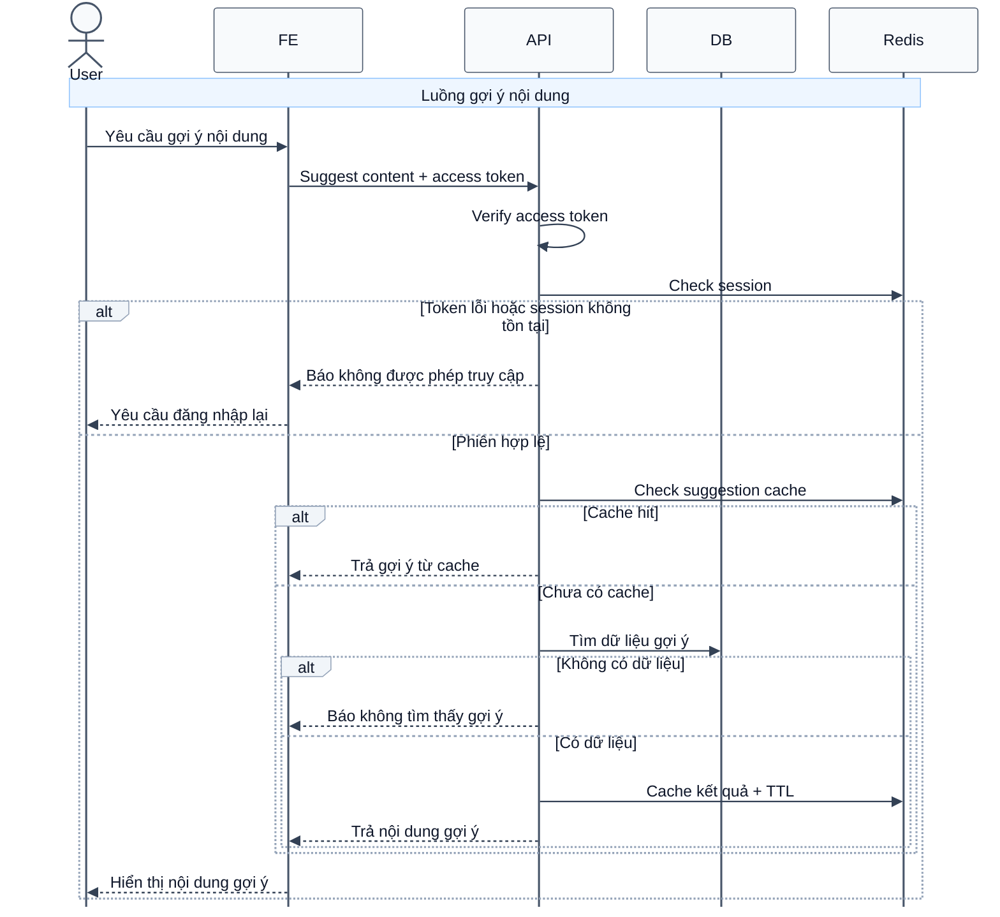

# Sequence Diagram: Gợi ý nội dung từ từ vựng

Sơ đồ dưới đây mô tả ngắn gọn nghiệp vụ lấy gợi ý nội dung cho một từ vựng. Hệ thống ưu tiên lấy kết quả từ cache, nếu chưa có thì tìm trong dữ liệu từ vựng và lưu lại để tái sử dụng.

