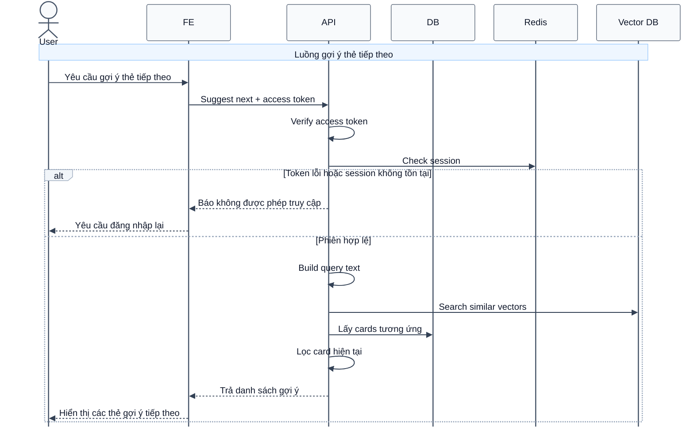

# Sequence Diagram: Gợi ý thẻ tiếp theo

Sơ đồ dưới đây mô tả ngắn gọn nghiệp vụ gợi ý thẻ tiếp theo dựa trên độ tương đồng nội dung. Hệ thống tìm các mục gần nghĩa trong vector database, sau đó lấy thông tin thẻ tương ứng từ cơ sở dữ liệu.

