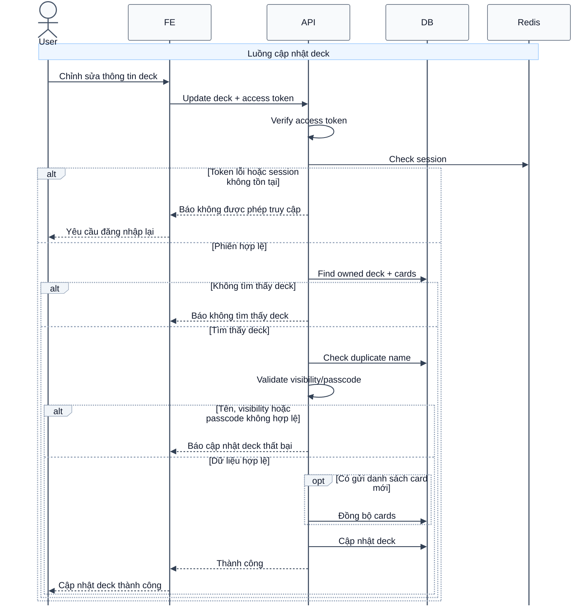

# Sequence Diagram: Cập nhật deck

Sơ đồ dưới đây mô tả ngắn gọn nghiệp vụ cập nhật deck trong module `deck`. Luồng này hỗ trợ cập nhật thông tin deck, thay đổi visibility/passcode và đồng bộ lại danh sách card.

