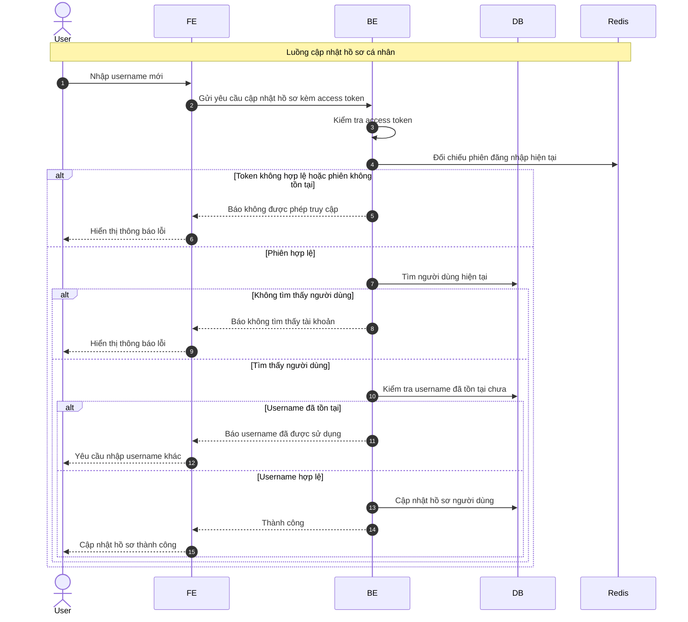

# Sequence Diagram: Cập nhật hồ sơ cá nhân

Sơ đồ dưới đây mô tả ngắn gọn nghiệp vụ cập nhật hồ sơ cá nhân trong module `user`. Hệ thống yêu cầu người dùng đang có phiên đăng nhập hợp lệ trước khi cập nhật username.

