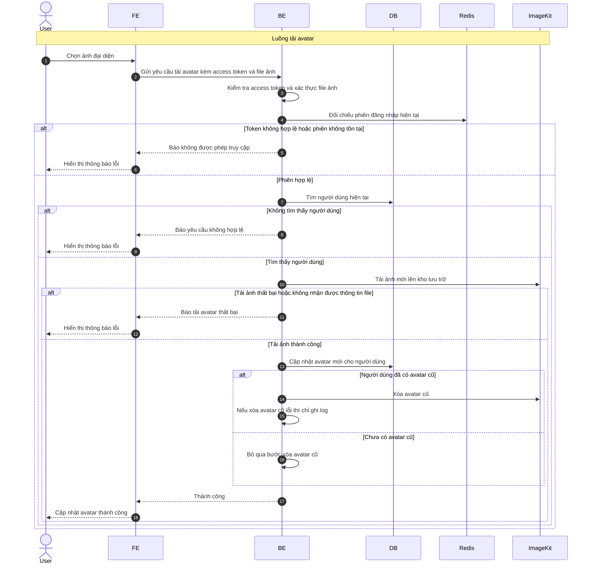

# Sequence Diagram: Tải avatar

Sơ đồ dưới đây mô tả ngắn gọn nghiệp vụ tải avatar trong module `user`. Hệ thống kiểm tra phiên đăng nhập, xác thực tệp ảnh, tải ảnh mới lên kho lưu trữ, sau đó cập nhật hồ sơ người dùng.

