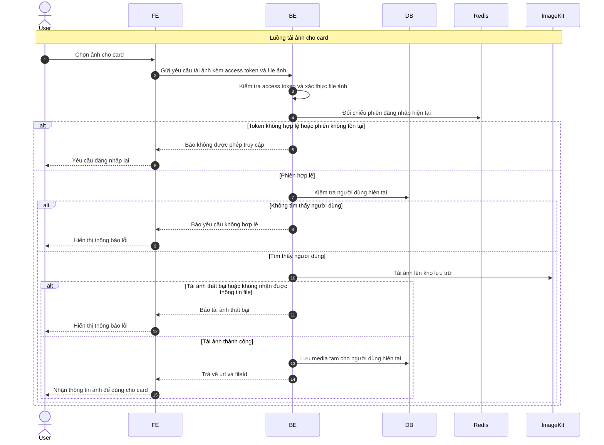

# Sequence Diagram: Tải ảnh cho card

Sơ đồ dưới đây mô tả ngắn gọn nghiệp vụ tải ảnh cho card trong module `deck`. Ảnh được tải lên kho lưu trữ trước, sau đó hệ thống lưu thông tin media tạm để frontend dùng cho các bước tạo hoặc cập nhật deck.

