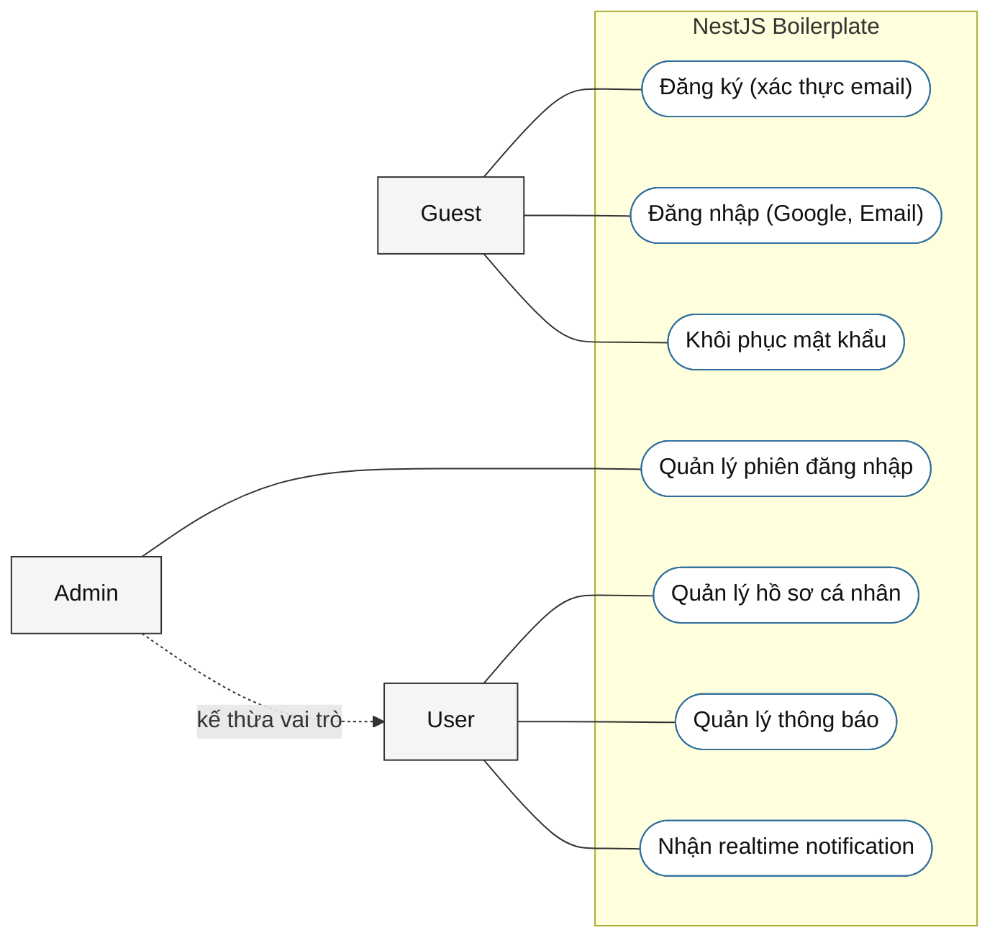

# Use Case Diagram

Sơ đồ dưới đây phản ánh phần boilerplate còn lại trong `src/modules` sau khi đã gỡ toàn bộ nghiệp vụ `deck`, `study`, `suggestion`.

## Mapping use case từ controller

- `Đăng ký tài khoản`: `POST /auth/sign-up`
- `Đăng nhập / xác thực`: `POST /auth/login`, `POST /auth/magic-link`, `POST /auth/verify-token`, `GET /auth/google/callback`
- `Xác minh email`: `POST /auth/email-verification/request`, `POST /auth/email-verification/confirm`
- `Khôi phục mật khẩu`: `POST /auth/password/reset/request`, `POST /auth/password/reset/confirm`, `POST /auth/password/reset`
- `Quản lý phiên đăng nhập`: `GET /auth/session`, `POST /auth/refresh`, `POST /auth/logout`, `POST /auth/password/change`
- `Quản lý hồ sơ cá nhân`: `PATCH /users/profile`, `POST /users/avatar`, `DELETE /users/avatar/:fileId`
- `Quản lý thông báo`: `GET /notifications`, `POST /notifications/read/:notificationId`, `POST /notifications/read-all`
