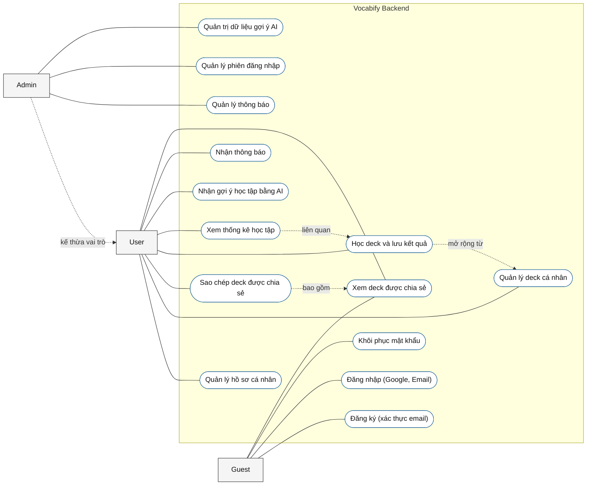

# Use Case Diagram

Sơ đồ dưới đây được tổng hợp từ các controller trong `src/modules` và được gom ở mức use case tổng quát nhất thay vì tách theo từng API nhỏ.

## Mapping use case từ controller

- `Đăng ký tài khoản`: `POST /auth/sign-up`
- `Đăng nhập / xác thực`: `POST /auth/login`, `POST /auth/magic-link`, `POST /auth/verify-token`, `GET /auth/google/callback`
- `Xác minh email`: `POST /auth/email-verification/request`, `POST /auth/email-verification/confirm`
- `Khôi phục mật khẩu`: `POST /auth/password/reset/request`, `POST /auth/password/reset/confirm`, `POST /auth/password/reset`
- `Xem deck chia sẻ`: `GET /decks/shared`, `GET /decks/shared/:deckId`
- `Quản lý phiên đăng nhập`: `GET /auth/session`, `POST /auth/refresh`, `POST /auth/logout`, `POST /auth/password/change`
- `Quản lý hồ sơ cá nhân`: `PATCH /users/profile`, `POST /users/avatar`, `DELETE /users/avatar/:fileId`
- `Quản lý deck cá nhân`: `GET /decks`, `GET /decks/:deckId`, `POST /decks`, `PATCH /decks/:deckId`, `DELETE /decks/:deckId`, `POST /decks/card-image`, `POST /decks/restart/:deckId`
- `Sao chép deck chia sẻ`: `POST /decks/clone/:deckId`
- `Học deck và lưu kết quả`: `POST /study/save-answers/:deckId`
- `Xem thống kê học tập`: `GET /study/stats`
- `Nhận gợi ý học tập bằng AI`: `POST /suggestion/content`, `POST /suggestion/next-card`
- `Quản lý thông báo`: `GET /notifications`, `POST /notifications/read/:notificationId`, `POST /notifications/read-all`
- `Quản trị dữ liệu gợi ý AI`: `POST /suggestion/embed-data` (`ADMIN`)
